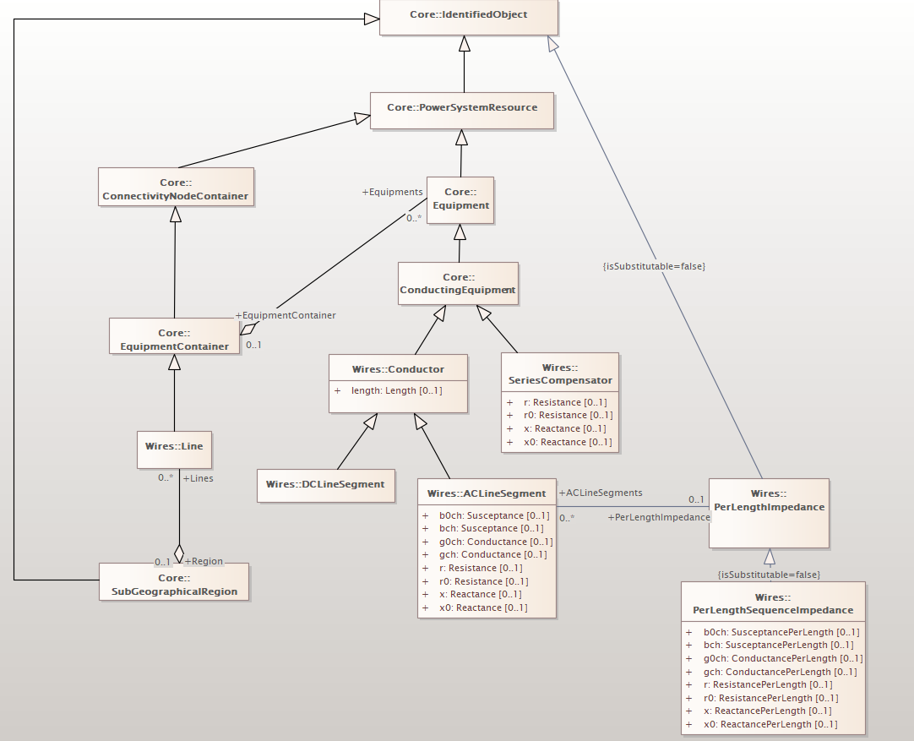

# mppm_projekat

<p>Povremeno pokrenuti sledeću komandu u PowerShell-u:</p>
```
Get-ChildItem .\ -include bin,obj -Recurse | foreach ($_) { remove-item $_.fullname -Force -Recurse }
```

<br/>
<hr/>
<br/>

<p align="center">
  
</p>
